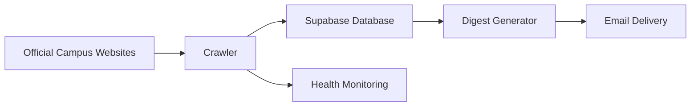

# HITnotice

A campus notification aggregation and email alert service for Harbin Institute of Technology.

## Overview

HITnotice automatically collects publicly available campus announcements from multiple official sources and delivers personalized email summaries. Users can choose between `weekday_digest` and `weekly_digest`: weekday summaries are sent at 20:00 from Monday to Friday, while weekly summaries are sent at 20:00 every Friday.

The service focuses on:

- Public information aggregation
- Automated monitoring
- Personalized notification
- Email digest delivery

HITnotice is designed for students and campus community members who want to follow selected official announcement sources without manually checking many separate websites.

## Features

- Automated collection from official campus information sources
- Multi-source announcement aggregation
- Incremental notification detection
- User-selectable weekday and weekly email digests
- Subscription-based source selection
- Subscription confirmation email
- One-click unsubscribe links
- Source health monitoring
- Failure detection and runtime status tracking
- Notices are deduplicated using stable hashes
- New notices are determined by `first_seen_at`
- Each digest type maintains independent delivery history

## How It Works



The crawler checks publicly accessible official announcement pages and stores discovered announcements in Supabase. The digest generator reads active subscriptions, groups newly discovered announcements by selected sources, and sends email summaries through Resend. Health monitoring records crawler status for each source.

## System Architecture

Frontend:

- Next.js
- React

Backend:

- Node.js
- TypeScript

Database:

- Supabase

Email:

- Resend

Deployment:

- Vercel
- Alibaba Cloud ECS
- Alibaba Cloud ECS cron jobs for scheduled tasks

## Notification Logic

- The crawler runs through Alibaba Cloud ECS cron jobs.
- Notices are deduplicated by a stable hash derived from the source and normalized URL.
- `first_seen_at` is used to determine newly discovered notices.
- `weekday_digest` runs from Monday to Friday at 20:00 Beijing time.
- `weekly_digest` runs every Friday at 20:00 Beijing time.
- `email_deliveries` stores delivery history separately for each digest type.

## Data Sources

HITnotice currently covers selected public campus information sources, including:

- University-level sources
- Graduate and undergraduate related offices
- Schools and departments

The supported source list is defined in the project source registry and may be updated as official websites change.

## Deployment

Required services:

- Node.js
- Supabase
- Resend
- Vercel
- Environment variables for database, email delivery, site URL, and monitoring

Production deployment uses Vercel for the web application. Production scheduling is handled by Alibaba Cloud ECS cron jobs: `crawl:notices` runs before digest delivery, `send:digest` runs at 20:00 on weekdays, and the health report runs after digest execution. No real credentials or production configuration values should be committed to this repository.

## Environment Variables

Copy `.env.example` and provide values in your local or deployment environment.

```env
# Supabase configuration
NEXT_PUBLIC_SUPABASE_URL=
NEXT_PUBLIC_SUPABASE_ANON_KEY=
SUPABASE_SERVICE_ROLE_KEY=

# Email service
RESEND_API_KEY=
EMAIL_FROM=

# Public site URL
NEXT_PUBLIC_SITE_URL=

# Admin and monitoring
ADMIN_CHECK_TOKEN=
HEALTH_REPORT_EMAIL=
```

Do not commit real environment variable values, API keys, service-role keys, or local production configuration files.

## Local Development

Install dependencies:

```bash
npm install
```

Run the development server:

```bash
npm run dev
```

Run project checks:

```bash
npm run lint
npm run build
```

Run the crawler without writing to the database:

```bash
npm run crawl:notices -- --dry-run
```

Generate digests without sending emails or writing delivery records:

```bash
npm run send:digest -- --dry-run --type=weekday_digest
npm run send:digest -- --dry-run --type=weekly_digest
```

Dry-run mode does not send email and does not write `email_deliveries` records.

## Version

Current version:

v1.0

## Privacy

HITnotice stores the email address and subscription preferences required to send email digests. It does not collect real names, student IDs, phone numbers, campus card numbers, or unified identity authentication information.

HITnotice only aggregates publicly accessible notice pages and does not access private or login-protected content.

## Disclaimer

HITnotice is an independent student-developed service.

It is not an official platform of Harbin Institute of Technology.

All official information should be verified through university websites.

## License

This project is licensed under the MIT License.
